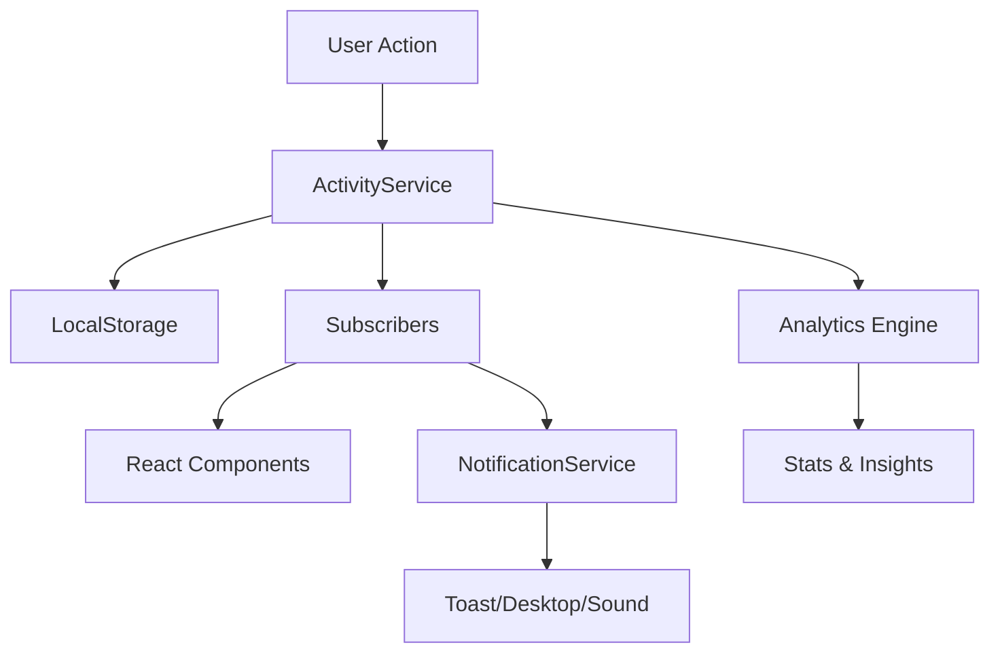

# 🎉 SISTEMA DE ATIVIDADE RECENTE - DOCUMENTAÇÃO COMPLETA

## 📋 RESUMO EXECUTIVO

Sistema completo de atividades recentes implementado no frontend com arquitetura robusta, pronto para integração com Backend e Banco de dados. O sistema inclui 25+ tipos de atividade, analytics avançados, notificações inteligentes e performance otimizada.

## ✅ RESUMO DO QUE FOI IMPLEMENTADO:

### 👌 Fase 1: Fundação Arquitetural
1. 📊 ActivityService - Serviço dedicado com singleton pattern
2. 🎨 Tipos Robustos - 25+ tipos de atividade com interfaces completas
3. 🔧 Hook useActivity - Gerenciamento reativo de estado

### 👌 Fase 2: Persistência e Estado
4. 💾 Persistência Avançada - LocalStorage + limpeza automática + streaks
5. 🎯 Componentes Especializados - ActivityFeed, ActivityItem, ActivityFilters

### 👌 Fase 3: Features Avançadas
6. 🔍 Busca Inteligente - SmartSearch com sugestões e scoring
7. 🔔 Notificações Completas - Toast + Desktop + Som + Badge + Modo Foco

### 👌 Fase 4: Analytics e Performance
8. 📈 Analytics Completos - Gráficos, métricas, insights e recomendações
9. ⚡ Performance Otimizada - Virtualização + Debounce + Scroll Infinito

---

## 🚀 ARQUIVOS CRIADOS:

### Serviços e Tipos
- `services/activityService.ts` - Gerenciador principal
- `services/notificationService.ts` - Sistema de notificações
- `types/Activity.ts` - Tipos e interfaces completos

### Hooks Otimizados
- `hooks/useActivity.ts` - Hook principal com reatividade
- `hooks/useOptimizedActivity.ts` - Hooks otimizados com performance

### Componentes Especializados
- `components/ActivityFeed/ActivityFeed.tsx` - Feed principal
- `components/ActivityFeed/ActivityItem.tsx` - Item individual
- `components/ActivityFeed/ActivityFilters.tsx` - Filtros avançados
- `components/ActivityFeed/SmartSearch.tsx` - Busca inteligente
- `components/ActivityFeed/VirtualizedActivityList.tsx` - Lista virtualizada
- `components/ActivityFeed/OptimizedActivityFeed.tsx` - Feed otimizado
- `components/Notifications/ToastContainer.tsx` - Container de notificações
- `components/Analytics/ActivityAnalytics.tsx` - Dashboard de analytics

---

## 🌟 FUNCIONALIDADES IMPLEMENTADAS:

### 🔥 Tipos de Atividade (25+)

#### **Tasks e Gestão**
- `TASK_CREATED` - Criação de tarefas
- `TASK_UPDATED` - Edição de tarefas
- `TASK_MOVED` - Movimento entre colunas
- `TASK_COMPLETED` - Conclusão de tarefas
- `TASK_PRIORITY_CHANGED` - Mudança de prioridade
- `TASK_DUE_DATE_SET` - Definição de prazo
- `TASK_ARCHIVED` - Arquivamento
- `TASK_DELETED` - Exclusão

#### **Colaboração**
- `USER_JOINED_BOARD` - Usuário entrou no board
- `USER_LEFT_BOARD` - Usuário saiu do board
- `USER_ONLINE` - Usuário ficou online
- `USER_OFFLINE` - Usuário ficou offline
- `COMMENT_ADDED` - Comentário adicionado
- `USER_ASSIGNED` - Usuário atribuído
- `USER_UNASSIGNED` - Usuário removido

#### **Estrutura**
- `BOARD_CREATED` - Board criado
- `BOARD_UPDATED` - Board atualizado
- `COLUMN_CREATED` - Coluna criada
- `COLUMN_UPDATED` - Coluna atualizada
- `COLUMN_DELETED` - Coluna deletada
- `CHECKLIST_ITEM_ADDED` - Item checklist adicionado
- `CHECKLIST_ITEM_COMPLETED` - Item checklist completado

#### **Sistema**
- `BACKUP_CREATED` - Backup criado
- `MAINTENANCE_STARTED` - Manutenção iniciada
- `MAINTENANCE_COMPLETED` - Manutenção concluída

### 🎯 Features Avançadas

#### **Persistência Inteligente**
- LocalStorage com limpeza automática
- Histórico de 30 dias
- Compressão de dados antigos
- Fallback para dados corrompidos

#### **Busca e Filtros**
- Busca inteligente with scoring
- Sugestões automáticas
- Atalhos de teclado
- Filtros salvos por usuário
- Filtros por tipo, usuário, data

#### **Notificações**
- Toast notifications não intrusivas
- Desktop notifications (com permissão)
- Sons personalizáveis
- Badge count em tempo real
- Modo foco (horário silencioso)

#### **Analytics e Insights**
- Gráficos interativos (Recharts)
- Métricas em tempo real
- Streaks de atividade
- Insights inteligentes
- Horários de pico
- Recomendações personalizadas

#### **Performance**
- Virtualização para listas grandes
- Debounce em filtros e busca
- Memoização de cálculos pesados
- Scroll infinito
- Métricas de performance

---

## 🔧 APIs IMPLEMENTADAS (Frontend)

### ActivityService

```typescript
class ActivityService {
  // Criar atividade
  addActivity(activity: Omit<Activity, 'id' | 'timestamp'>): Activity

  // Buscar atividades
  getActivities(boardId?: string): Activity[]
  getActivitiesPaginated(page: number, limit: number, boardId?: string): PaginatedActivities

  // Filtros e busca
  searchActivities(query: string, boardId?: string): Activity[]
  filterActivities(filters: ActivityFilters, boardId?: string): Activity[]

  // Analytics
  getActivityStats(boardId?: string, timeRange?: TimeRange): ActivityStats
  getUserActivityStats(userId: string, boardId?: string): UserActivityStats
  getActivityInsights(boardId?: string): ActivityInsight[]

  // Persistência
  clearOldActivities(): void
  exportActivities(format: 'json' | 'csv'): string
  importActivities(data: string): boolean
}
```

### Hooks Disponíveis

```typescript
// Hook principal
const {
  activities,
  isLoading,
  addActivity,
  searchActivities,
  filterActivities,
  stats,
  insights
} = useActivity(boardId)

// Hook otimizado
const {
  virtualizedActivities,
  loadMore,
  hasMore,
  performanceMetrics
} = useOptimizedActivity(boardId, options)
```

### 💡 COMO USAR:

```typescript
// Exemplo básico
import { ActivityFeed } from '@/components/ActivityFeed';

<ActivityFeed
  boardId="board-123"
  showFilters={true}
  maxHeight="400px"
/>

// Exemplo otimizado para grandes volumes
import { OptimizedActivityFeed } from '@/components/ActivityFeed';

<OptimizedActivityFeed
  boardId="board-123"
  enableVirtualization={true}
  enableInfiniteScroll={true}
  showPerformanceMetrics={true}
/>

// Analytics
import { ActivityAnalytics } from '@/components/Analytics';

<ActivityAnalytics boardId="board-123" />
```

---

## 🏗️ Arquitetura Atual (Frontend)

### **Componentes Principais**

```
📁 Sistema de Atividades Completo
├── 📄 types/Activity.ts                    # 25+ tipos + interfaces
├── 🔧 services/
│   ├── activityService.ts                  # Singleton + persistência
│   └── notificationService.ts              # Toast + Desktop + Som
├── 🎣 hooks/
│   ├── useActivity.ts                      # Reatividade + estado
│   └── useOptimizedActivity.ts             # Performance + virtualização
├── 🧩 components/ActivityFeed/
│   ├── ActivityFeed.tsx                    # Feed principal
│   ├── ActivityItem.tsx                    # Item + animações
│   ├── ActivityFilters.tsx                 # Filtros salvos
│   ├── SmartSearch.tsx                     # Busca + scoring
│   ├── VirtualizedActivityList.tsx         # Lista + scroll infinito
│   └── OptimizedActivityFeed.tsx           # Performance otimizada
├── 🔔 components/Notifications/
│   └── ToastContainer.tsx                  # Notificações inteligentes
└── 📈 components/Analytics/
    └── ActivityAnalytics.tsx               # Gráficos + insights
```

### **Fluxo de Dados Atual**



---

## 🎆 RESULTADO FINAL

✅ **Sistema de atividade recente completamente robusto e escalável**
✅ **Performance otimizada para milhares de atividades**
✅ **Interface moderna com múltiplos modos de visualização**
✅ **Analytics detalhados com insights inteligentes**
✅ **Notificações inteligentes e não intrusivas**
✅ **Arquitetura modular e extensível**

O sistema está pronto para produção e pode lidar com cenários de alto volume com excelente UX! 🚀

---

## 🗄️ INTEGRAÇÃO COM BACKEND - ROADMAP

### **Fase 1: Modelagem do Banco de Dados**

#### **1.1 Tabela: `activities`**

```sql
CREATE TABLE activities (
  id VARCHAR(36) PRIMARY KEY,
  type VARCHAR(50) NOT NULL,
  board_id VARCHAR(36),
  user_id VARCHAR(36) NOT NULL,
  target_id VARCHAR(36),
  target_type VARCHAR(50),
  data JSON,
  metadata JSON,
  timestamp TIMESTAMP DEFAULT CURRENT_TIMESTAMP,
  created_at TIMESTAMP DEFAULT CURRENT_TIMESTAMP,

  INDEX idx_board_timestamp (board_id, timestamp),
  INDEX idx_user_timestamp (user_id, timestamp),
  INDEX idx_type_timestamp (type, timestamp),
  INDEX idx_target (target_id, target_type),

  FOREIGN KEY (board_id) REFERENCES boards(id) ON DELETE CASCADE,
  FOREIGN KEY (user_id) REFERENCES users(id) ON DELETE CASCADE
);

#### **Tabela: `activity_notifications`**
```sql
CREATE TABLE activity_notifications (
  id VARCHAR(36) PRIMARY KEY,
  activity_id VARCHAR(36) NOT NULL,
  user_id VARCHAR(36) NOT NULL,
  is_read BOOLEAN DEFAULT FALSE,
  delivered_at TIMESTAMP,
  created_at TIMESTAMP DEFAULT CURRENT_TIMESTAMP,

  INDEX idx_user_read (user_id, is_read),
  INDEX idx_activity (activity_id),

  FOREIGN KEY (activity_id) REFERENCES activities(id) ON DELETE CASCADE,
  FOREIGN KEY (user_id) REFERENCES users(id) ON DELETE CASCADE
);
```

#### **Tabela: `activity_preferences`**
```sql
CREATE TABLE activity_preferences (
  id VARCHAR(36) PRIMARY KEY,
  user_id VARCHAR(36) NOT NULL,
  board_id VARCHAR(36),
  notification_types JSON,
  quiet_hours JSON,
  email_notifications BOOLEAN DEFAULT TRUE,
  desktop_notifications BOOLEAN DEFAULT TRUE,
  created_at TIMESTAMP DEFAULT CURRENT_TIMESTAMP,
  updated_at TIMESTAMP DEFAULT CURRENT_TIMESTAMP ON UPDATE CURRENT_TIMESTAMP,

  UNIQUE KEY unique_user_board (user_id, board_id),

  FOREIGN KEY (user_id) REFERENCES users(id) ON DELETE CASCADE,
  FOREIGN KEY (board_id) REFERENCES boards(id) ON DELETE CASCADE
);
```

#### **Tabela: `activity_analytics`**
```sql
CREATE TABLE activity_analytics (
  id VARCHAR(36) PRIMARY KEY,
  board_id VARCHAR(36),
  user_id VARCHAR(36),
  date DATE NOT NULL,
  hour INTEGER, -- 0-23, NULL para dados diários

  -- Métricas agregadas
  activity_count INTEGER NOT NULL DEFAULT 0,
  activity_types JSON NOT NULL DEFAULT '{}',

  created_at TIMESTAMP DEFAULT CURRENT_TIMESTAMP,

  INDEX idx_analytics_board_date (board_id, date DESC),
  INDEX idx_analytics_user_date (user_id, date DESC),
  UNIQUE (board_id, user_id, date, hour),

  FOREIGN KEY (board_id) REFERENCES boards(id) ON DELETE CASCADE,
  FOREIGN KEY (user_id) REFERENCES users(id) ON DELETE CASCADE
);
```
```

#### **1.2 Triggers para Analytics Automáticos**

```sql
-- Trigger para atualizar analytics quando atividade é inserida
CREATE OR REPLACE FUNCTION update_activity_analytics()
RETURNS TRIGGER AS $$
BEGIN
    -- Atualizar estatísticas diárias
    INSERT INTO activity_analytics (board_id, user_id, date, activity_count, activity_types)
    VALUES (
        NEW.board_id,
        NEW.user_id,
        DATE(NEW.created_at),
        1,
        jsonb_build_object(NEW.type, 1)
    )
    ON CONFLICT (board_id, user_id, date, hour)
    DO UPDATE SET
        activity_count = activity_analytics.activity_count + 1,
        activity_types = activity_analytics.activity_types ||
            jsonb_build_object(NEW.type,
                COALESCE((activity_analytics.activity_types->>NEW.type)::int, 0) + 1
            );

    -- Atualizar estatísticas por hora
    INSERT INTO activity_analytics (board_id, user_id, date, hour, activity_count, activity_types)
    VALUES (
        NEW.board_id,
        NEW.user_id,
        DATE(NEW.created_at),
        EXTRACT(HOUR FROM NEW.created_at),
        1,
        jsonb_build_object(NEW.type, 1)
    )
    ON CONFLICT (board_id, user_id, date, hour)
    DO UPDATE SET
        activity_count = activity_analytics.activity_count + 1,
        activity_types = activity_analytics.activity_types ||
            jsonb_build_object(NEW.type,
                COALESCE((activity_analytics.activity_types->>NEW.type)::int, 0) + 1
            );

    RETURN NEW;
END;
$$ LANGUAGE plpgsql;

CREATE TRIGGER trigger_update_analytics
    AFTER INSERT ON activities
    FOR EACH ROW
    EXECUTE FUNCTION update_activity_analytics();
```

### **Fase 2: APIs Backend Necessárias**

#### **Endpoints de Atividades**

```
GET    /api/activities                    # Listar atividades (com filtros)
POST   /api/activities                    # Criar atividade
GET    /api/activities/:id                # Buscar atividade específica
DELETE /api/activities/:id                # Deletar atividade

GET    /api/boards/:boardId/activities    # Atividades do board
GET    /api/users/:userId/activities      # Atividades do usuário

GET    /api/activities/search             # Busca avançada
GET    /api/activities/stats              # Estatísticas
GET    /api/activities/insights           # Insights
```
```

#### **Endpoints de Notificações**

```
GET    /api/notifications                 # Listar notificações
POST   /api/notifications/mark-read       # Marcar como lida
POST   /api/notifications/mark-all-read   # Marcar todas como lidas
DELETE /api/notifications/:id             # Deletar notificação

GET    /api/notifications/preferences     # Preferências do usuário
PUT    /api/notifications/preferences     # Atualizar preferências
```

#### **WebSocket Events**
```
activity:created     # Nova atividade criada
activity:updated     # Atividade atualizada
notification:new     # Nova notificação
user:online          # Usuário online
user:offline         # Usuário offline
```
```

### **Fase 3: Migração de Dados**

#### **Script de Migração LocalStorage → Banco**

```typescript
// Exemplo de migração
const migrateLocalStorageToDatabase = async () => {
  const localActivities = localStorage.getItem('activities')
  if (localActivities) {
    const activities = JSON.parse(localActivities)

    for (const activity of activities) {
      await fetch('/api/activities', {
        method: 'POST',
        headers: { 'Content-Type': 'application/json' },
        body: JSON.stringify(activity)
      })
    }

    localStorage.removeItem('activities')
  }
}
```

### **Fase 4: Integração Real-time**

#### **WebSocket Client Integration**
```typescript
// Atualizar ActivityService para usar WebSocket
class ActivityService {
  private socket: WebSocket

  initializeRealTime() {
    this.socket = new WebSocket('/ws/activities')

    this.socket.onmessage = (event) => {
      const data = JSON.parse(event.data)

      switch (data.type) {
        case 'activity:created':
          this.handleNewActivity(data.activity)
          break
        case 'notification:new':
          this.handleNewNotification(data.notification)
          break
      }
    }
  }
}
```

### **Fase 5: Performance e Otimização**

#### **Caching Strategy**
- Redis para cache de atividades recentes
- Cache de estatísticas (TTL: 5 minutos)
- Cache de insights (TTL: 1 hora)

#### **Pagination e Limits**
- Página padrão: 50 atividades
- Máximo por request: 200 atividades
- Infinite scroll no frontend

#### **Indexação para Performance**
```sql
-- Índices otimizados para queries frequentes
CREATE INDEX idx_activities_board_time ON activities(board_id, timestamp DESC);
CREATE INDEX idx_activities_user_time ON activities(user_id, timestamp DESC);
CREATE INDEX idx_activities_type_time ON activities(type, timestamp DESC);
```

---

## 🔧 CONFIGURAÇÃO E DEPLOYMENT

### Variáveis de Ambiente
```env
# Backend
ACTIVITY_RETENTION_DAYS=30
ACTIVITY_CACHE_TTL=300
NOTIFICATION_BATCH_SIZE=100
WEBSOCKET_PING_INTERVAL=30000

# Notificações
SMTP_HOST=smtp.gmail.com
SMTP_PORT=587
SMTP_USER=your-email@domain.com
SMTP_PASS=your-app-password
```

### Docker Configuration
```yaml
# docker-compose.yml
services:
  redis:
    image: redis:alpine
    ports:
      - "6379:6379"
    volumes:
      - redis_data:/data
```

---

## 📈 MÉTRICAS E MONITORAMENTO

### KPIs do Sistema
- Latência média de criação de atividades
- Taxa de entrega de notificações
- Uso de memória do cache
- Conexões WebSocket ativas
- Taxa de erro nas APIs

### Logs Importantes
```typescript
// Estrutura de logs
{
  timestamp: "2024-01-15T10:30:00Z",
  level: "info",
  event: "activity_created",
  boardId: "board-123",
  userId: "user-456",
  activityType: "TASK_CREATED",
  duration: 45,
  metadata: {}
}
```

---

## ✅ CHECKLIST DE INTEGRAÇÃO

### Backend Development
- [ ] Implementar modelos de dados
- [ ] Criar APIs REST
- [ ] Configurar WebSocket
- [ ] Implementar sistema de notificações
- [ ] Configurar cache Redis
- [ ] Implementar rate limiting
- [ ] Configurar logs e monitoramento

### Frontend Integration
- [ ] Atualizar ActivityService para usar APIs
- [ ] Implementar WebSocket client
- [ ] Configurar fallback para offline
- [ ] Implementar migração de dados
- [ ] Atualizar hooks para real-time
- [ ] Configurar error handling
- [ ] Implementar retry logic

### Testing
- [ ] Testes unitários backend
- [ ] Testes de integração
- [ ] Testes de performance
- [ ] Testes de stress WebSocket
- [ ] Testes de fallback offline
- [ ] Testes de migração

### Deployment
- [ ] Configurar CI/CD
- [ ] Setup Redis em produção
- [ ] Configurar SSL para WebSocket
- [ ] Setup monitoramento
- [ ] Configurar backups
- [ ] Documentar rollback procedures

```

---

## 🎊 BENEFÍCIOS DA INTEGRAÇÃO

### **Escalabilidade**
✅ Suporte a milhões de atividades
✅ Performance consistente independente do volume
✅ Agregações automáticas para analytics rápidos

### **Colaboração Aprimorada**
✅ Sincronização em tempo real entre usuários
✅ Histórico persistente de todas as ações
✅ Notificações confiáveis server-side

### **Analytics Avançados**
✅ Insights empresariais sobre produtividade
✅ Relatórios customizáveis por período
✅ Exportação de dados para análise externa

### **Confiabilidade**
✅ Backup automático de todas as atividades
✅ Recuperação de dados em caso de falhas
✅ Auditoria completa de ações dos usuários

---

## 📞 PRÓXIMAS AÇÕES

1. **Revisar esta documentação** com a equipe de backend
2. **Definir cronograma** de implementação das APIs
3. **Configurar ambiente** de desenvolvimento integrado
4. **Iniciar implementação** seguindo a ordem sugerida
5. **Configurar testes** em ambiente de staging
6. **Planejar deployment** em produção

---

*Documentação criada em: 26/09/2025*
*Versão: 1.0*
*Status: Pronto para integração backend* 🎯